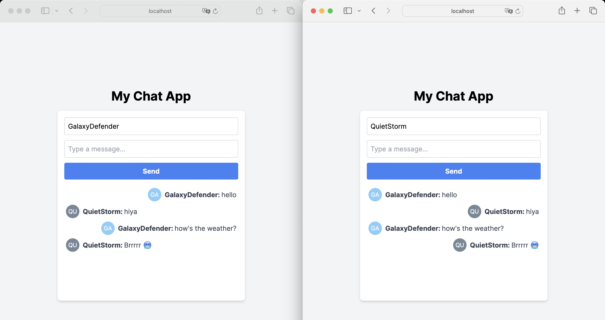
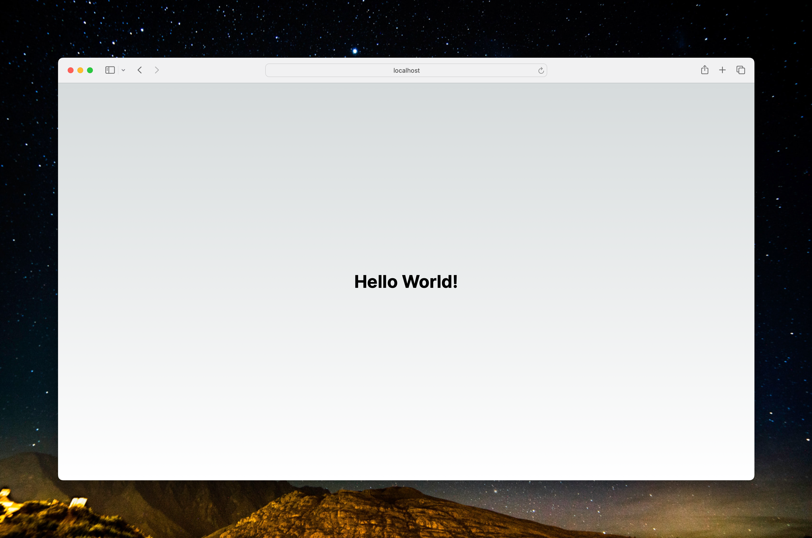
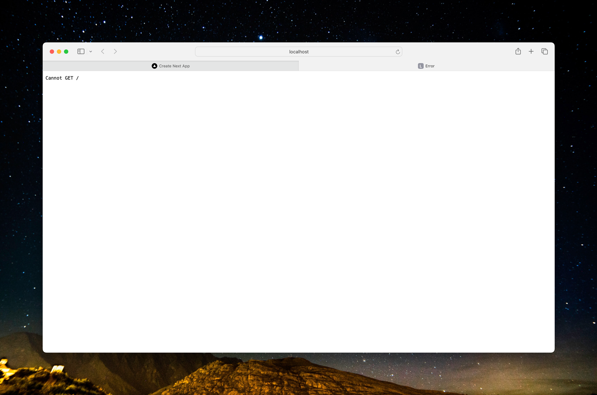
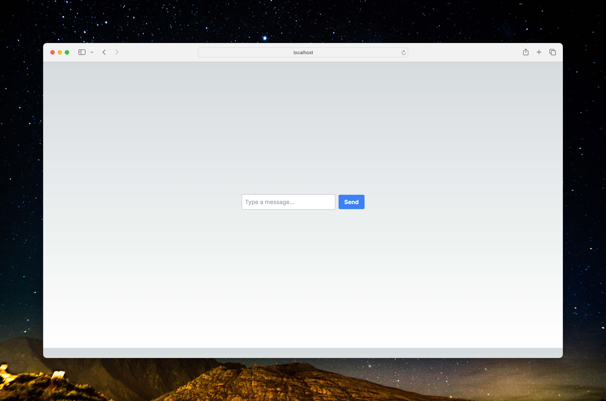
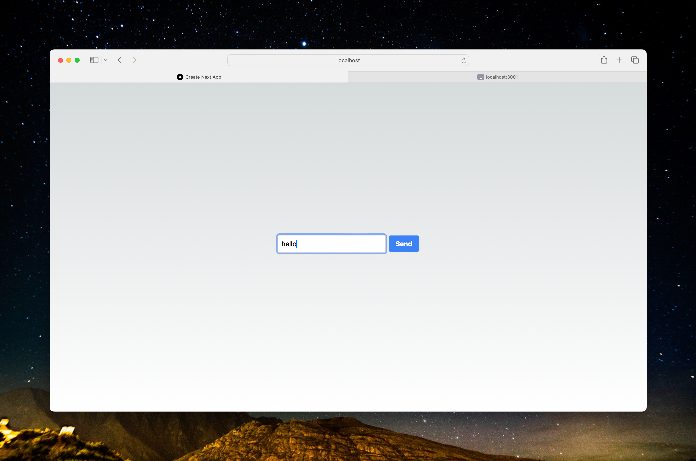
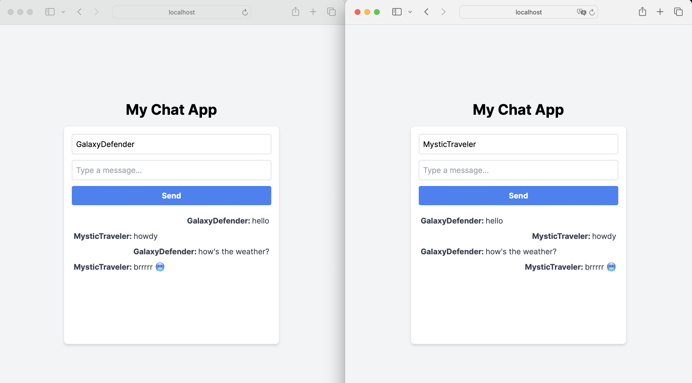

## What we are building
In this guide, we'll make a chat app where you can send and see messages instantly. We'll use Next.js for the website, Socket.IO for chatting in real-time, and Tailwind CSS to make it look nice. 



## Prerequisites

Ensure Node.js, npm, and npx are installed. Use the following commands to verify:

- `node -v`
- `npm -v`
- `npx --version`

If they're not installed, download [Node.js](https://nodejs.org/en/), which includes npm and npx.

## Step 1: Setting Up the Development Environment

1. **Create a Next.js App**:

   ```bash
   npx create-next-app@latest my-chat-app
   ```

   You'll encounter a series of prompts. Here are the responses you should provide:

   - TypeScript: No

   - ESLint: Yes

   - Tailwind CSS: Yes

   - src/ directory: NoApp Router: Yes

   - Customize default import alias (@/*): No

     

   Navigate to your new app directory:

   ```bash
   cd my-chat-app
   ```

2. **Install Tailwind CSS**:

   ```bash
   npm install -D tailwindcss postcss autoprefixer
   npx tailwindcss init -p
   ```

   Follow the Tailwind CSS [documentation](https://tailwindcss.com/docs) for configuration.

3. **Run Your App**:

   ```bash
   npm run dev
   ```

   Open `http://localhost:3000` to see your app.

   

### Mini Exercise: "Hello World" Example

1. **Edit `app/page.js`**:
   Replace the content with:

   ```javascript
   export default function Home() {
     return (
       <div className="flex justify-center items-center h-screen">
         <h1 className="text-4xl font-bold">Hello World!</h1>
       </div>
     );
   }
   ```

2. **Test**: Refresh `http://localhost:3000` to see "Hello World!".



---

## Step 2: Setting up the server

#### 2.1: Initial Server Setup

1. **Install Socket.IO**: 

```bash
npm install socket.io
```

2. **Create `server.js` in the root of your project**:
   Start with a basic server setup using Express and HTTP:

```javascript
const express = require('express');
const http = require('http');
const { Server } = require('socket.io');

const app = express();
const server = http.createServer(app);
const io = new Server(server);

server.listen(3001, () => {
  console.log('Server is running on http://localhost:3001');
});
```

3. **Run and Test**:

- Execute `node server.js`.
- The server starts on `http://localhost:3001`, but with no response for HTTP requests yet.




#### 2.2: Adding CORS Configuration

1. **Modify `server.js`**:
   Include CORS (Cross-Origin Resource Sharing) to allow your frontend to communicate with the server:

   ```javascript
   const express = require('express');
   const http = require('http');
   const { Server } = require('socket.io');
   
   const app = express();
   const server = http.createServer(app);
   const io = new Server(server, {
     cors: {
       origin: "http://localhost:3000", // Frontend URL
       methods: ["GET", "POST"]
     }
   });
   
   server.listen(3001, () => {
     console.log('Server is running on http://localhost:3001');
   });
   
   ```
   
   CORS is essential for client-server communication, especially when they run on different ports or domains. Here, it allows your Next.js frontend on `localhost:3000` to connect to the server on `localhost:3001`.
   
4. **Test**:

   - Restart the server (`node server.js`).
   - Check for no errors, but functionality remains the same as before.

#### 2.3: Implementing Basic Route Handling

1. **Update `server.js`**:
   Add a route handler to respond to HTTP GET requests:

   ```javascript
   const express = require('express');
   const http = require('http');
   const { Server } = require('socket.io');
   
   const app = express();
   const server = http.createServer(app);
   
   const io = new Server(server, {
     cors: {
       origin: "http://localhost:3000", // Frontend URL
       methods: ["GET", "POST"]
     }
   });
   
   app.get('/', (req, res) => {
     res.send('Socket.IO server is running');
   });
   
   server.listen(3001, () => {
     console.log('Server is running on http://localhost:3001');
   });
   ```
   
   This route provides a simple response when accessing the root URL of your server. It's useful for confirming that the server is running and reachable.
   
3. **Test**:

   - Restart the server.
   - Visit `http://localhost:3001` in a browser and verify the "Socket.IO server is running" message.

   

#### 2.4: Setting Up Socket.IO Event Listeners

1. **Extend `server.js`**:
   Add Socket.IO event listeners for handling connections, messages, and disconnections:

   ```javascript
   const express = require('express');
   const http = require('http');
   const { Server } = require('socket.io');
   
   const app = express();
   const server = http.createServer(app);
   
   const io = new Server(server, {
     cors: {
       origin: "http://localhost:3000", // Frontend URL
       methods: ["GET", "POST"]
     }
   });
   
   app.get('/', (req, res) => {
     res.send('Socket.IO server is running');
   });
   
   io.on('connection', (socket) => {
     console.log('A user connected');
   
     socket.on('chat message', (msg) => {
       console.log('Message received: ' + msg);
       io.emit('chat message', msg);
     });
   
     socket.on('disconnect', () => {
       console.log('A user disconnected');
     });
   });
   
   server.listen(3001, () => {
     console.log('Server is running on http://localhost:3001');
   });
   
   ```
   
   - `io.on('connection', ...)`: Listens for new client connections.
   - `socket.on('chat message', ...)`: Handles incoming chat messages and broadcasts them to all connected clients.
   - `socket.on('disconnect', ...)`: Logs when a user disconnects.
   
3. **Test**:

   - Restart the server.
   - Test by connecting with a client (in later steps) and check the console for log messages.

#### 2.5 Final Code for Server.js

After completing all the sub-steps for setting up the server, your `server.js` should look like this:

```javascript
const express = require('express');
const http = require('http');
const { Server } = require('socket.io');

const app = express();
const server = http.createServer(app);

// CORS configuration for Socket.IO
const io = new Server(server, {
  cors: {
    origin: "http://localhost:3000", // Allowing the frontend URL
    methods: ["GET", "POST"]
  }
});

// Route handler for HTTP GET requests to the root URL ("/")
app.get('/', (req, res) => {
  res.send('Socket.IO server is running'); // Sending a response for root URL requests
});

// Event listener for new Socket.IO connections
io.on('connection', (socket) => {
  console.log('A user connected'); // Logging when a new user connects

  // Event listener for 'chat message' events from clients
  socket.on('chat message', (msg) => {
    console.log('Message received: ' + msg); // Logging received messages
    io.emit('chat message', msg); // Broadcasting the received message to all clients
  });

  // Event listener for disconnect events
  socket.on('disconnect', () => {
    console.log('A user disconnected'); // Logging when a user disconnects
  });
});

// Starting the server on port 3001
server.listen(3001, () => {
  console.log('Server is running on http://localhost:3001');
});
```


----

## Step 3: Creating the Basic React Frontend - 100% new

#### 3.1: Basic Frontend UI Setup

Start by setting up a simple user interface for the chat application.

1. **Update `app/page.js`**:
   Begin with a basic structure including an input field for messages and a send button.

   ```javascript
   export default function Page() {
     return (
       <div className="flex flex-col items-center justify-center h-screen">
         <div className="mb-4">
           <input 
             type="text" 
             placeholder="Type a message..."
             className="border-2 border-gray-300 rounded p-2 mr-2"
           />
           <button 
             className="bg-blue-500 hover:bg-blue-700 text-white font-bold py-2 px-4 rounded"
           >
             Send
           </button>
         </div>
       </div>
     );
   }
   ```

2. **Test**: 

   - Run the app and ensure the input field and send button are displayed correctly.
   
   

#### 3.2 **Add the "use client" Directive**: 

At the beginning of your `Page` component, add `"use client";` to specify that it's a client-side component. This should be the very first line inside your component function before any other code

```javascript
"use client"; // // Specify that this is a client-side component

export default function Page() {
 //previous code
}
```


#### 3.3: Adding State Management for Messages

Implement state management for handling messages.

1. **Enhance `app/page.js`**:
   Introduce `useState` to manage the message input and an array of messages.

   ```javascript
   "use client"; // // Specify that this is a client-side component
   
   import React, { useState } from 'react';
   
   export default function Page() {
     const [message, setMessage] = useState('');
     const [messages, setMessages] = useState([]);
   
     return (
       // previous code
     );
   }
   ```

2. #### Utilizing State in the UI

   Use the state variables to handle message input and display messages.

   

   Here’s what the code should look like at this stage:

   ```javascript
   "use client"; 
   
   import React, { useState } from 'react';
   
   export default function Page() {
     const [message, setMessage] = useState('');
     const [messages, setMessages] = useState([]);
   
     return (
       <div className="flex flex-col items-center justify-center h-screen">
         <div className="mb-4">
           <input 
             type="text"
             value={message}
             onChange={(e) => setMessage(e.target.value)}
             placeholder="Type a message..."
             className="border-2 border-gray-300 rounded p-2 mr-2"
           />
           <button 
             className="bg-blue-500 hover:bg-blue-700 text-white font-bold py-2 px-4 rounded"
           >
             Send
           </button>
         </div>
         <div>
           {messages.map((msg, index) => (
             <p key={index} className="text-gray-700">{msg}</p>
           ))}
         </div>
       </div>
     );
   }
   ```

3. **Test**: 

   - Refresh your app to make sure there are no errors. 
   - Although you won't see visual changes on the screen yet, the message state is now ready to handle user input and store messages. This setup lays the foundation for interactive features to be added in the next steps.

#### 3.4: Establishing Socket.IO Client Connection

Let's now connect the frontend to the Socket.IO server for real-time communication.

1. **Install Socket.IO Client**: Run the following command in your project directory to install the Socket.IO client library:

   ```bash
   npm install socket.io-client
   ```

   This command adds the Socket.IO client to your project, allowing you to establish a connection with the Socket.IO server.

2. **Modify `app/page.js`**:
   Integrate the Socket.IO client.

```javascript
import React, { useState } from 'react';
import io from 'socket.io-client';

const socket = io('http://localhost:3001');

// Rest of the code remains the same
```

1. **Test**:
   - Ensure the app runs without errors.

#### 3.5: Implementing Message Sending and Receiving

Enable the functionality to send and display messages in real-time.

1. **Update `app/page.js`**:
   Add logic for message sending and receiving.

   ```javascript
   "use client"; // Specify that this is a client-side component
   
   import React, { useState } from 'react';
   import io from 'socket.io-client';
   
   const socket = io('http://localhost:3001');
   
   export default function Page() {
     const [message, setMessage] = useState('');
     const [messages, setMessages] = useState([]);
   
     const sendMessage = () => {
       if (message) {
         socket.emit('chat message', message);
         setMessage('');
       }
     };
     
     const handleKeyDown = (event) => {
       if (event.key === 'Enter') {
         sendMessage();
       }
     };
   
     return (
       <div className="flex flex-col items-center justify-center h-screen">
         <div className="mb-4">
           <input 
             type="text"
             value={message}
             onChange={(e) => setMessage(e.target.value)}
             placeholder="Type a message..."
             className="border-2 border-gray-300 rounded p-2 mr-2"
           />
           <button 
             onClick={sendMessage} // Attach sendMessage to button click
             className="bg-blue-500 hover:bg-blue-700 text-white font-bold py-2 px-4 rounded"
           >
             Send
           </button>
         </div>
         <div>
           {messages.map((msg, index) => (
             <p key={index} className="text-gray-700">{msg}</p>
           ))}
         </div>
       </div>
     );
   }
   ```
   
2. **Test**: 

   - Type a message, like "hello", into the input field and click the "Send" button.
   - While the message won't yet display in your app's UI, you should see a log in your server's console output indicating `"Message received: hello"`.
   - This indicates that the message is being successfully sent from the client to the server.




#### Step 3.6: Refactoring UI into `ChatUI` Component

Update `ChatUI.js`:

Separate the chat interface into a new component, `ChatUI`, for better structure and maintainability.

1. **Create `ChatUI.js`**:
   - Extract the chat interface from `page.js` into a new component.

```javascript
// ChatUI.js
import React, { forwardRef } from 'react';

const ChatUI = forwardRef(({ message, setMessage, sendMessage, messages }, ref) => {
  return (
    <div className="flex flex-col items-center justify-center h-screen">
      <div className="mb-4">
        <input 
          ref={ref}
          type="text"
          value={message}
          onChange={(e) => setMessage(e.target.value)}
          placeholder="Type a message..."
          className="border-2 border-gray-300 rounded p-2 mr-2"
        />
        <button 
          onClick={sendMessage}
          className="bg-blue-500 hover:bg-blue-700 text-white font-bold py-2 px-4 rounded"
        >
          Send
        </button>
      </div>
      <div>
        {messages.map((msg, index) => (
          <p key={index} className="text-gray-700">{msg}</p>
        ))}
      </div>
    </div>
  );
});

export default ChatUI;
```

2. **Update `page.js`**:

Import and utilize the `ChatUI` component while removing redundant code.

```javascript
// page.js
// ...existing imports...
import ChatUI from './ChatUI';

export default function Page() {
  // ...useState hooks and sendMessage function...
  
  return (
    <ChatUI 
      message={message}
      setMessage={setMessage}
      sendMessage={sendMessage}
      messages={messages}
    />
  );
}
```

1. **Test**:
   - Refresh your app to ensure the ChatUI component renders correctly with Tailwind CSS styling.
   - You will not see any changes, except that this step refactors the UI into a separate component. We are not ready to make UI changes to our chat app. 

#### Step 3.7: Displaying Messages with Random Usernames

1. Update `page.js` with Random Usernames:

First, modify `page.js` to generate random usernames:

```javascript
"use client"; // Specify that this is a client-side component

import React, { useState, useEffect, useRef } from 'react';
import io from 'socket.io-client';
import ChatUI from './ChatUI';

const socket = io('http://localhost:3001');

export default function Page() {
  const [username, setUsername] = useState('');
  const [message, setMessage] = useState('');
  const [messages, setMessages] = useState([]);

  const messageInputRef = useRef(null);

  useEffect(() => {
    // Generate a default random username
    const randomNames = ["BlueRaven", "QuietStorm", "Sunshine", "CrazyArtist", "MoonWalker", "StarGazer", "OceanDreamer", "MysticTraveler", "DigitalWizard", "GalaxyDefender"];
    setUsername(randomNames[Math.floor(Math.random() * randomNames.length)]);

    socket.on('chat message', (data) => {
      setMessages((prevMessages) => [...prevMessages, data]);
    });

    return () => {
      socket.off('chat message');
    };
  }, []);

  const sendMessage = () => {
    if (message) {
      socket.emit('chat message', { username, text: message });
      setMessage('');
    }
  };

  return (
    <ChatUI 
      username={username}
      setUsername={setUsername}
      message={message}
      setMessage={setMessage}
      sendMessage={sendMessage}
      messages={messages}
      ref={messageInputRef}
    />
  );
}

```

2. Update `ChatUI.js`:

Then, reflect the changes in `ChatUI.js` to display messages:

```javascript
// ChatUI.js
import React, { forwardRef } from 'react';

const ChatUI = forwardRef(({ username, setUsername, message, setMessage, handleKeyDown, sendMessage, messages }, ref) => {
  return (
    <div className="flex flex-col items-center justify-center h-screen bg-gray-100 p-4">
      <h1 className="text-3xl font-bold mb-4">My Chat App</h1>
      <div className="w-full max-w-md bg-white rounded-lg border border-gray-200 shadow-md p-4">
        <div className="mb-4">
          {/* Text box for changing username */}
          <input 
            type="text" 
            value={username}
            onChange={(e) => setUsername(e.target.value)}
            className="w-full p-2 border border-gray-300 rounded mb-3"
            placeholder="Username"
          />
          {/* Message input field */}
          <input 
            ref={ref}
            type="text" 
            value={message}
            onChange={(e) => setMessage(e.target.value)}
            onKeyDown={handleKeyDown}
            className="w-full p-2 border border-gray-300 rounded mb-3"
            placeholder="Type a message..."
          />
          <button 
            onClick={sendMessage}
            className="w-full bg-blue-500 hover:bg-blue-700 text-white font-bold py-2 px-4 rounded"
          >
            Send
          </button>
        </div>
        <div className="overflow-y-auto h-64">
          {messages.map((msg, index) => (
            <div key={index} className={`flex items-center p-1 ${msg.username === username ? 'justify-end' : 'justify-start'}`}>
              <p className={`${msg.username === username ? 'text-right' : 'text-left'} text-gray-700`}>
                <strong>{msg.username}: </strong> {msg.text}
              </p>
            </div>
          ))}
        </div>
      </div>
    </div>
  );
});

export default ChatUI;

```

3. **Test**:

- Refresh your app to ensure that messages are displayed correctly with random usernames.
- Each session will have a unique username, enhancing the chat experience.



## Step 4: Optional Enhancement: Adding Avatar Functionality

1. #### Update `page.js`:

   1. **Modify `page.js` for Avatars**: Add logic to generate a URL for avatars based on the username and a randomly chosen color.

      ```javascript
      "use client"; // Directive to specify that this is a client-side component in Next.js
      
      import { useEffect, useState, useRef } from 'react';
      import io from 'socket.io-client';
      import ChatUI from './ChatUI'; // Import the ChatUI component
      
      let socket;
      
      export default function Page() {
        // Arrays of random names and colors for user avatars
        const randomNames = ["BlueRaven", "QuietStorm", "Sunshine", "CrazyArtist", "MoonWalker", "StarGazer", "OceanDreamer", "MysticTraveler", "DigitalWizard", "GalaxyDefender"];
        const randomColors = ["E6E6FA", "FFC0CB", "FFD700", "98FB98", "AFEEEE", "DB7093", "FFA07A", "20B2AA", "87CEFA", "778899"];
        
        const [username, setUsername] = useState(randomNames[Math.floor(Math.random() * randomNames.length)]);
        const [avatarColor, setAvatarColor] = useState(randomColors[Math.floor(Math.random() * randomColors.length)]);
        const [message, setMessage] = useState('');
        const [messages, setMessages] = useState([]);
      
        const messageInputRef = useRef(null);
      
        useEffect(() => {
          socket = io('http://localhost:3001');
      
          socket.on('chat message', (data) => {
            setMessages((prevMessages) => [...prevMessages, data]);
          });
      
          // Focus the message input field when the component mounts
          if (messageInputRef.current) {
            messageInputRef.current.focus();
          }
      
          return () => {
            socket.off('chat message');
          };
        }, []);
      
        const sendMessage = () => {
          if (message) {
            const avatarUrl = `https://ui-avatars.com/api/?name=${encodeURIComponent(username)}&background=${avatarColor}&color=fff`;
            socket.emit('chat message', { username, text: message, avatar: avatarUrl });
            setMessage('');
          }
        };
      
        const handleKeyDown = (event) => {
          if (event.key === 'Enter') {
            sendMessage();
          }
        };
      
        return (
          <ChatUI 
            username={username}
            setUsername={setUsername}
            message={message}
            setMessage={setMessage}
            handleKeyDown={handleKeyDown}
            sendMessage={sendMessage}
            messages={messages}
            ref={messageInputRef}
          />
        );
      }
      ```

      2. Update `ChatUI.js`:

      1. **Modify `ChatUI.js`**: Adjust the UI component to display avatars next to each message.

```javascript
// ChatUI.js
import React, { forwardRef } from 'react';

const ChatUI = forwardRef(({ username, setUsername, message, setMessage, handleKeyDown, sendMessage, messages }, ref) => {
  return (
    <div className="flex flex-col items-center justify-center h-screen bg-gray-100 p-4">
      <h1 className="text-3xl font-bold mb-4">My Chat App</h1>
      <div className="w-full max-w-md bg-white rounded-lg border border-gray-200 shadow-md p-4">
        <div className="mb-4">
          <input 
            type="text" 
            value={username}
            onChange={(e) => setUsername(e.target.value)}
            className="w-full p-2 border border-gray-300 rounded mb-3"
            placeholder="Username"
          />
          <input 
            ref={ref}
            type="text" 
            value={message}
            onChange={(e) => setMessage(e.target.value)}
            onKeyDown={handleKeyDown}
            className="w-full p-2 border border-gray-300 rounded mb-3"
            placeholder="Type a message..."
          />
          <button 
            onClick={sendMessage}
            className="w-full bg-blue-500 hover:bg-blue-700 text-white font-bold py-2 px-4 rounded"
          >
            Send
          </button>
        </div>
        <div className="overflow-y-auto h-64">
          {messages.map((msg, index) => (
            <div key={index} className={`flex items-center p-1 ${msg.username === username ? 'justify-end' : 'justify-start'}`}>
              {/* Display avatar next to message */}
              
              <p className={`${msg.username === username ? 'text-right' : 'text-left'} text-gray-700`}>
                <strong>{msg.username}: </strong> {msg.text}
              </p>
            </div>
          ))}
        </div>
      </div>
    </div>
  );
});

export default ChatUI;

```


